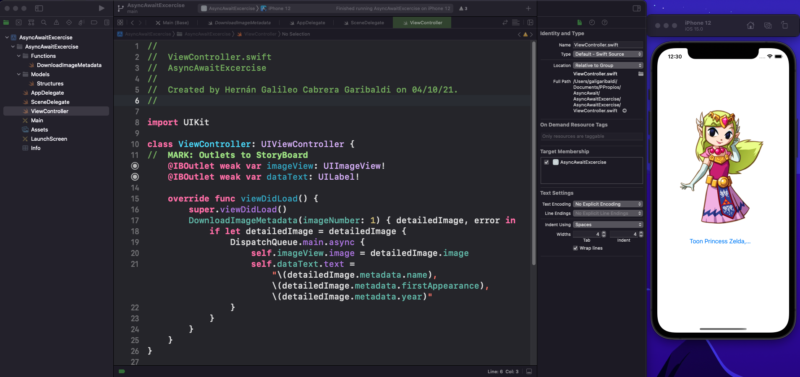
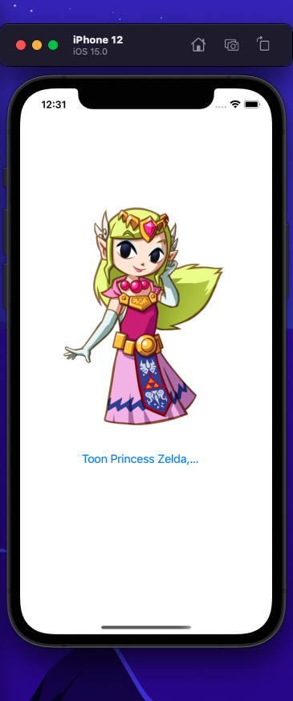
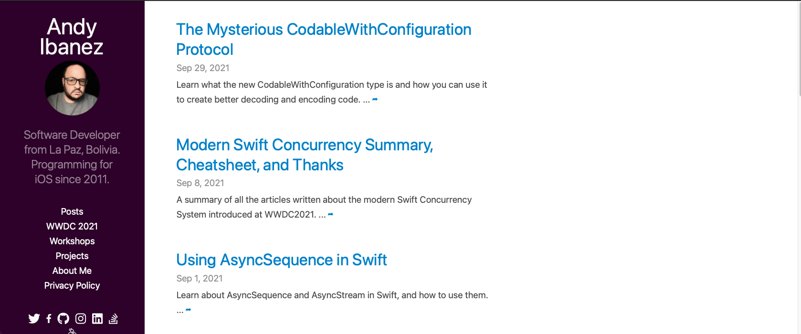

# Async Await Excercise

This Repository is from to the third Project about IO's development Degree.

## **What is it?** 

This is a implementation about Async Await Excercise, this theme was discussed in class with profesor Norberto, and he was leave homework for the students, **Do a implementation with DispatchQueue**. After time this is my implementation

**Project Screen**

**Cell Phone Screen**

## Where is the original Code?

The original code is property to *Andy Ibañez*, you can found in the some links:

- [Web Site](https://www.andyibanez.com)
- [Github](https://github.com/AndyIbanez)
- [Theme in Web Site about Async Await](https://www.andyibanez.com/posts/understanding-actors-in-the-new-concurrency-model-in-swift/)

## Who I am?

My name is:  Hernán Galileo Cabrera Garibaldi, and you contact me in this Social networks:

- Email: galigaribaldi0@gmail.com
- Github: https://github.com/galigaribaldi
- Linkedin: www.linkedin.com/in/galileogaribaldi
